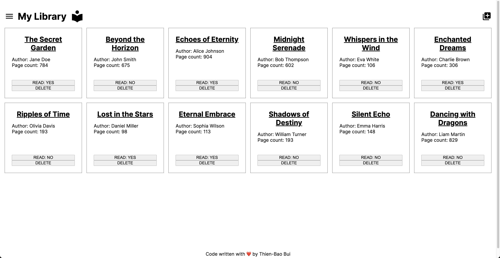

# Library Project

## Overview
The Library project is a frontend project aimed at enhancing my skills in JavaScript, using the FormData API to fetch user-inputted data, 
and developing JS classes.

I also learned more about DOM manipulation and using pure HTML/CSS/JS to develop a dynamic modal window to improve the user experience.

## Preview

## Demo
To see it live, check it [here](https://tbbui-732.github.io/library/)
